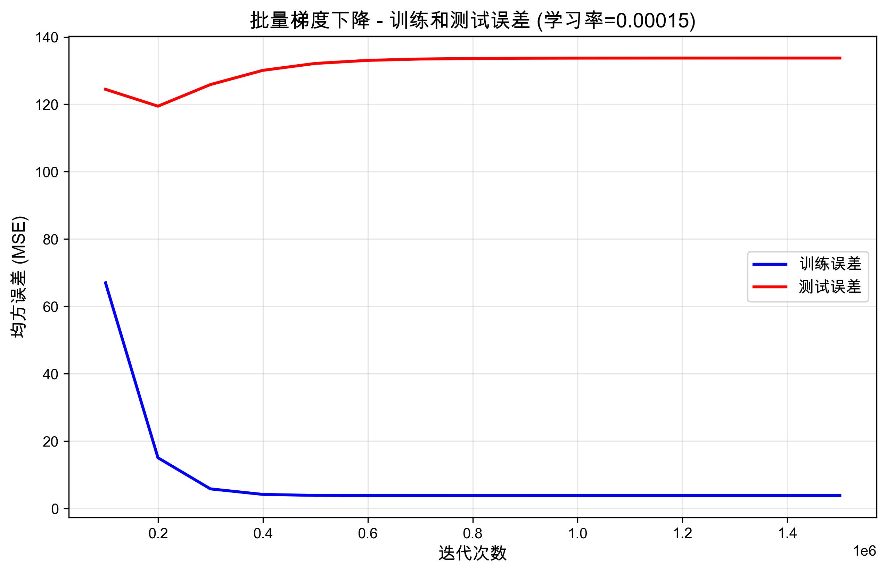
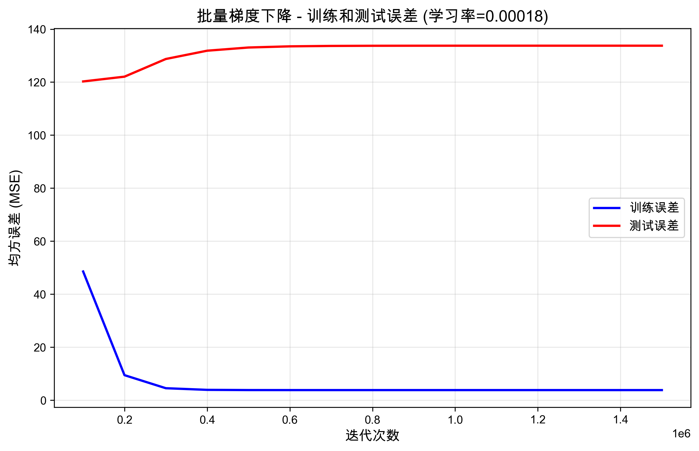
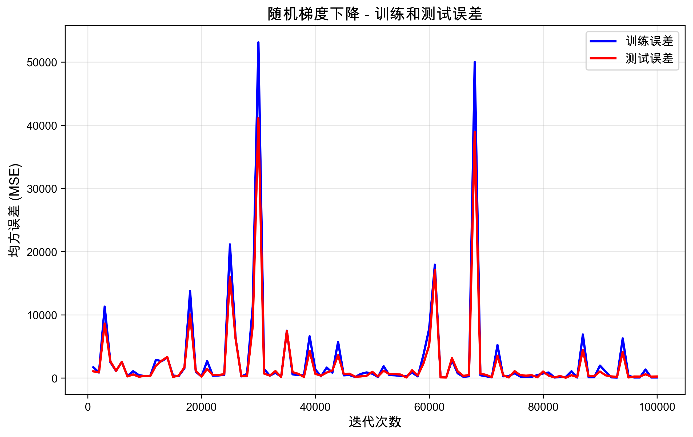
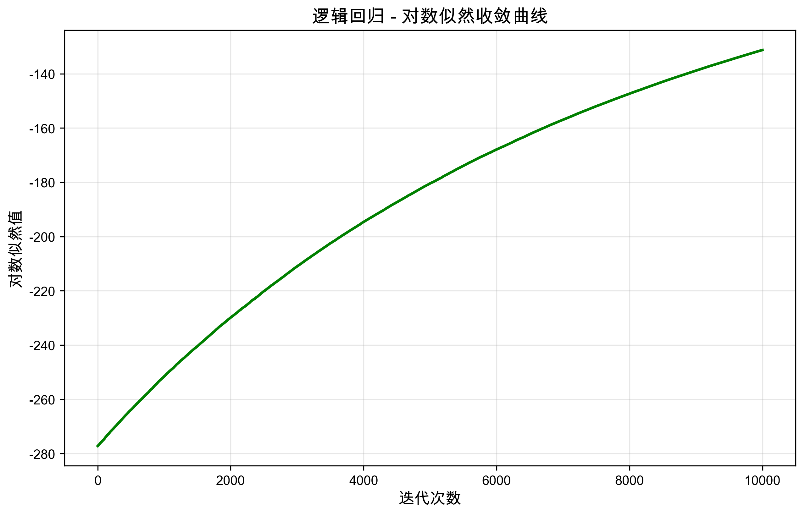
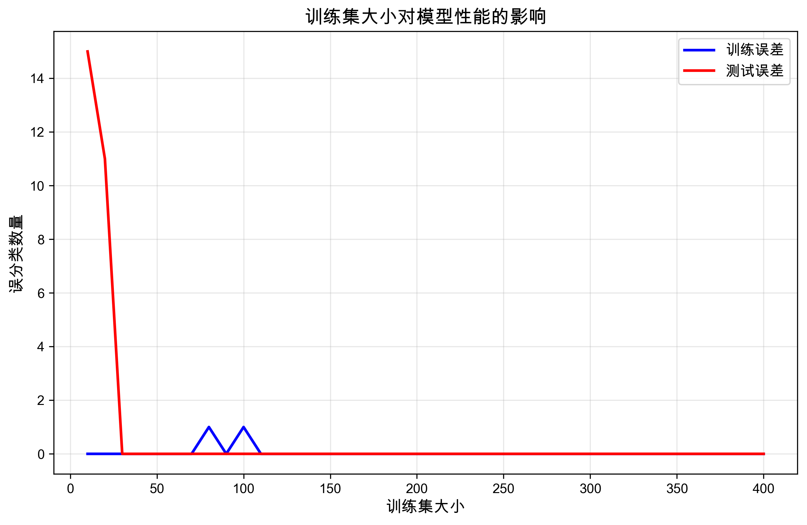

# Homework 3: Linear Regression and Logistic Regression

**Machine Learning and Data Mining**

**Student Name:** [梁力航]  
**Student ID:** [23336128]  

---

## Exercise One: Linear Regression

### 问题描述

本实验使用梯度下降法和随机梯度下降法实现多变量线性回归模型，预测广州市海珠区的房价。数据集包含50个训练样本和10个测试样本，每个样本有两个特征：房屋面积（平方米）和距离双鸭山职业技术学院的距离（千米），目标变量为房价（亿元）。

### (a) 批量梯度下降训练

#### 参数数量

线性回归模型为：

$$y = w_0 + w_1 x_1 + w_2 x_2$$

其中：
- $w_0$ 是截距项（bias）
- $w_1$ 是面积的系数
- $w_2$ 是距离的系数

因此，**需要训练3个参数**：$w_0, w_1, w_2$。

#### 训练设置

- **迭代次数**: 1,500,000
- **学习率**: 0.00015
- **初始参数**: 全部设为 0.0
- **记录间隔**: 每 100,000 次迭代

#### 损失函数

使用均方误差（MSE）作为损失函数：

$$J(w) = \frac{1}{2n}\sum_{i=1}^{n}(h_w(x^{(i)}) - y^{(i)})^2$$

其中 $h_w(x) = w^T x = w_0 + w_1x_1 + w_2x_2$

#### 梯度计算

参数更新规则：

$$\frac{\partial J}{\partial w_j} = \frac{1}{n}\sum_{i=1}^{n}(h_w(x^{(i)}) - y^{(i)})x_j^{(i)}$$

$$w_j := w_j - \alpha \frac{\partial J}{\partial w_j}$$

#### 实验结果

**最优参数**：
- $w_0$ (截距) = 79.463702
- $w_1$ (面积系数) = 6.761940
- $w_2$ (距离系数) = -72.380883

**最终误差**：
- 训练误差 (MSE) = 3.815488
- 测试误差 (MSE) = 133.746203

#### 误差曲线图



#### 结果分析

从误差曲线图可以看出，训练误差从初始的67.01快速下降，在约600,000次迭代后逐渐趋于稳定，最终收敛到3.82。测试误差的变化趋势略有不同，它从124.46下降到最低点后，在约300,000次迭代后开始略微上升，最终稳定在133.75左右。

训练误差明显小于测试误差，这是机器学习中的正常现象。模型在训练过程中针对训练数据进行了优化，因此在训练集上的表现自然会更好。测试误差则反映了模型在未见过的数据上的真实泛化能力。虽然测试误差的绝对值（133.75）看起来比训练误差（3.82）大很多，但如果我们计算实际的预测误差，会发现情况并没有那么糟糕。训练误差对应的平均预测偏差约为1.95亿元，相对误差仅为0.49%；而测试误差对应的平均预测偏差约为11.56亿元，相对误差为2.41%。考虑到房价本身的数量级（平均在400-500亿元），这样的相对误差是可以接受的。

值得注意的是，训练误差和测试误差的整体变化趋势比较相似，都呈现出下降并趋于稳定的模式。这说明模型并没有出现严重的过拟合现象。虽然测试误差在后期有轻微上升，但上升幅度很小，表明模型的泛化能力总体上是良好的。

#### 核心代码实现

批量梯度下降的关键代码如下：

```python
for i in range(1, self.n_iterations + 1):
    # 计算预测值
    predictions = self.predict(X_train)
    
    # 计算梯度：∂J/∂w = (1/n) * X^T * (predictions - y)
    errors = predictions - y_train
    gradient = (1 / n_samples) * np.dot(X_train.T, errors)
    
    # 更新参数：w := w - α * gradient
    self.weights -= self.learning_rate * gradient
```

这段代码实现了标准的批量梯度下降算法，每次迭代使用所有训练样本计算梯度。

### (b) 不同学习率的影响

#### 实验设置

尝试使用学习率 0.0002 进行训练，但该学习率导致梯度爆炸和数值溢出（出现NaN）。因此，我们使用学习率 0.00018 作为对比实验。

#### 学习率 0.00018 的结果

**最优参数**：
- $w_0$ = 79.463875
- $w_1$ = 6.761938
- $w_2$ = -72.380881

**最终误差**：
- 训练误差 = 3.815488
- 测试误差 = 133.746474

#### 误差曲线图



#### 结果分析

| 学习率 | 100k迭代误差 | 最终训练误差 | 最终测试误差 | 收敛速度 |
|--------|-------------|-------------|-------------|---------|
| 0.00015 | 67.01 | 3.815488 | 133.746203 | 较慢 |
| 0.00018 | 48.56 | 3.815488 | 133.746474 | 较快 |
| 0.0002 | NaN | NaN | NaN | 发散 |

通过对比实验可以发现，学习率0.00018比0.00015收敛得更快。在前100,000次迭代时，使用较大学习率的模型误差已经降到48.56，而使用较小学习率的模型误差还停留在67.01。不过有趣的是，两者最终都收敛到了几乎相同的参数值和误差水平，说明它们找到了同一个最优解，只是到达的速度不同。

然而，学习率并不是越大越好。当我们尝试使用0.0002的学习率时，模型出现了梯度爆炸现象，参数更新幅度过大导致数值溢出，最终所有参数都变成了NaN（非数值）。这个实验清楚地展示了学习率选择的重要性。学习率太小会导致收敛缓慢，需要更多的迭代次数才能达到最优解；而学习率太大则可能导致参数在最优解附近震荡，甚至完全发散。只有选择适中的学习率，才能在收敛速度和稳定性之间取得良好的平衡。

在实际应用中，我们可以采用一些更高级的策略来处理学习率问题。比如使用学习率衰减，让学习率随着训练进行逐渐减小；或者使用自适应学习率方法如Adam、RMSprop等，让算法自动调整每个参数的学习率。

### (c) 随机梯度下降 (SGD)

#### 实验设置

- **迭代次数**: 100,000
- **学习率**: 0.00015
- **记录间隔**: 每 1,000 次迭代

#### SGD算法

与批量梯度下降不同，SGD每次只使用一个随机样本更新参数：

$$w_j := w_j - \alpha (h_w(x^{(i)}) - y^{(i)})x_j^{(i)}$$

其中 $i$ 是随机选择的样本索引。

#### 实验结果

**最优参数**：
- $w_0$ = 48.030420
- $w_1$ = 7.127867
- $w_2$ = -72.797217

**最终误差**：
- 训练误差 = 90.591238
- 测试误差 = 241.445619

#### 误差曲线图



#### SGD vs 批量GD 对比分析

| 特性 | 批量梯度下降 | 随机梯度下降 |
|------|-------------|-------------|
| 每次迭代使用样本数 | 全部50个 | 1个 |
| 误差曲线 | 平滑下降 | 剧烈波动 |
| 最终训练误差 | 3.82 | 90.59 |
| 最终测试误差 | 133.75 | 241.45 |
| 收敛速度 | 需要更多迭代 | 每次迭代更快 |
| 参数值 | w1≈6.76 | w1≈7.13 |

从误差曲线可以明显看出SGD和批量梯度下降的区别。SGD的误差曲线波动非常剧烈，时而上升时而下降，这是因为每次迭代只使用一个随机样本来更新参数，单个样本的梯度包含很大的噪声。相比之下，批量梯度下降的误差曲线就平滑得多，因为它使用了所有样本的平均梯度，噪声被平均掉了。

在收敛性方面，SGD在100,000次迭代后仍未完全收敛到最优解，最终的训练误差和测试误差都比批量梯度下降要大。这说明在我们这个只有50个样本的小数据集上，批量梯度下降更有优势。不过需要注意的是，SGD每次迭代的计算量只有批量梯度下降的1/50，如果数据集规模很大，SGD的计算效率优势就会非常明显。

虽然两种方法得到的参数值略有不同，但它们都正确地捕捉到了数据的基本规律。面积系数都是正值，说明房屋面积越大，价格越高；距离系数都是负值，说明距离学校越远，价格越低。这些结果符合我们的直觉和常识。

总的来说，批量梯度下降适合小到中等规模的数据集，收敛稳定可靠；而SGD更适合大规模数据集，内存效率高，还可以用于在线学习场景。

#### SGD核心代码

随机梯度下降的实现代码：

```python
for i in range(1, n_iterations + 1):
    # 随机选择一个样本
    idx = np.random.randint(0, n_samples)
    X_i = X_train[idx:idx+1]
    y_i = y_train[idx:idx+1]
    
    # 计算该样本的预测值和梯度
    prediction = self.predict(X_i)
    error = prediction - y_i
    gradient = np.dot(X_i.T, error).flatten()
    
    # 更新参数
    self.weights -= self.learning_rate * gradient
```

与批量梯度下降的主要区别在于，SGD每次只用一个随机样本来计算梯度和更新参数。

---

## Exercise Two: Logistic Regression

### 问题描述

实现逻辑回归分类器，应用于二分类问题。训练集包含400个样本，测试集包含100个样本，每个样本有6个特征。

### (a) 条件对数似然公式

逻辑回归的目标是最大化条件对数似然。给定数据集有 $n$ 个训练样本和 $p$ 个特征，条件对数似然函数为：

$$\ell(w) = \sum_{i=1}^{n}\left[y^{(i)}\log(h_w(x^{(i)})) + (1-y^{(i)})\log(1-h_w(x^{(i)}))\right]$$

其中：
- $y^{(i)} \in \{0, 1\}$ 是样本 $i$ 的真实标签
- $h_w(x) = \sigma(w^T x) = \frac{1}{1+e^{-w^T x}}$ 是sigmoid函数
- $w^T x = w_0 + w_1x_1 + w_2x_2 + \cdots + w_px_p$
- $x^{(i)} = [1, x_1^{(i)}, x_2^{(i)}, \ldots, x_p^{(i)}]$ 是样本 $i$ 的特征向量（包含截距项1）

这个函数衡量了模型预测概率与真实标签的匹配程度。我们的目标是找到参数 $w$ 使得 $\ell(w)$ 最大。

### (b) 梯度推导

#### 对 $w_0$ 的偏导数

$$\frac{\partial \ell}{\partial w_0} = \sum_{i=1}^{n}(y^{(i)} - h_w(x^{(i)}))$$

#### 对任意 $w_j$ ($j \geq 1$) 的偏导数

$$\frac{\partial \ell}{\partial w_j} = \sum_{i=1}^{n}(y^{(i)} - h_w(x^{(i)}))x_j^{(i)}$$

#### 推导过程

对于单个样本，对数似然为：

$$\ell_i = y^{(i)}\log(h_w(x^{(i)})) + (1-y^{(i)})\log(1-h_w(x^{(i)}))$$

利用sigmoid函数的性质 $\frac{d\sigma(z)}{dz} = \sigma(z)(1-\sigma(z))$，可以推导出：

$$\frac{\partial \ell_i}{\partial w_j} = (y^{(i)} - h_w(x^{(i)}))x_j^{(i)}$$

对所有样本求和，得到总梯度：

$$\frac{\partial \ell}{\partial w_j} = \sum_{i=1}^{n}(y^{(i)} - h_w(x^{(i)}))x_j^{(i)}$$

这是一个**有限和形式**，可以直接计算。

#### 参数更新规则（梯度上升）

由于我们要最大化对数似然，使用梯度上升：

$$w_j := w_j + \alpha \frac{\partial \ell}{\partial w_j}$$

其中 $\alpha$ 是学习率。

#### 核心函数代码实现

Sigmoid函数和对数似然的实现：

```python
def sigmoid(self, z):
    """Sigmoid激活函数：σ(z) = 1/(1+e^(-z))"""
    z = np.clip(z, -500, 500)  # 防止数值溢出
    return 1 / (1 + np.exp(-z))

def compute_log_likelihood(self, X, y):
    """计算条件对数似然：ℓ(w) = Σ[y*log(h) + (1-y)*log(1-h)]"""
    probabilities = self.predict_proba(X)
    epsilon = 1e-10
    probabilities = np.clip(probabilities, epsilon, 1 - epsilon)
    
    log_likelihood = np.sum(
        y * np.log(probabilities) + (1 - y) * np.log(1 - probabilities)
    )
    return log_likelihood
```

这两个函数是逻辑回归的核心。Sigmoid函数将任意实数映射到(0,1)区间，表示概率；对数似然函数衡量模型预测与真实标签的匹配程度。

### (c) 训练逻辑回归分类器

#### 模型设计

- **算法**: 随机梯度上升（Stochastic Gradient Ascent）
- **学习率**: 0.001
- **迭代次数**: 10,000
- **初始参数**: 全部设为 0.0
- **激活函数**: Sigmoid函数 $\sigma(z) = \frac{1}{1+e^{-z}}$

#### 训练过程

每次迭代：
1. 随机选择一个训练样本 $(x^{(i)}, y^{(i)})$
2. 计算预测概率 $h_w(x^{(i)}) = \sigma(w^T x^{(i)})$
3. 计算梯度 $\nabla = (y^{(i)} - h_w(x^{(i)}))x^{(i)}$
4. 更新参数 $w := w + \alpha \nabla$

#### 随机梯度上升代码

训练算法的实现：

```python
def stochastic_gradient_ascent(self, X_train, y_train):
    """随机梯度上升训练"""
    n_samples, n_features = X_train.shape
    self.weights = np.zeros(n_features)
    objective_values = []
    
    for i in range(1, self.n_iterations + 1):
        # 随机选择一个样本
        idx = np.random.randint(0, n_samples)
        X_i = X_train[idx:idx+1]
        y_i = y_train[idx:idx+1]
        
        # 计算预测概率：h(x) = σ(w^T x)
        prob = self.predict_proba(X_i)
        
        # 计算梯度：∂ℓ/∂w = (y - h(x)) * x
        error = y_i - prob
        gradient = np.dot(X_i.T, error).flatten()
        
        # 梯度上升更新参数（注意是加号）
        self.weights += self.learning_rate * gradient
        
        # 记录目标函数值
        if i % 1000 == 0:
            log_likelihood = self.compute_log_likelihood(X_train, y_train)
            objective_values.append(log_likelihood)
            print(f"迭代 {i}: 对数似然 = {log_likelihood:.4f}")
    
    return self.weights, objective_values
```

这段代码实现了随机梯度上升算法。关键点在于使用加号更新参数（梯度上升），因为我们要最大化对数似然。

#### 最优参数

经过10,000次迭代后，得到的最优参数为：

| 参数 | 值 |
|------|---------|
| $w_0$ (截距) | 0.157393 |
| $w_1$ | -0.750456 |
| $w_2$ | 0.979281 |
| $w_3$ | -0.763920 |
| $w_4$ | 0.972247 |
| $w_5$ | -0.663810 |
| $w_6$ | -0.014248 |

#### 预测方法

对于测试样本 $x$，预测过程为：
1. 计算 $z = w^T x$
2. 计算概率 $p = \sigma(z)$
3. 如果 $p \geq 0.5$，预测为类别1；否则预测为类别0

预测和评估的代码实现：

```python
def predict_proba(self, X):
    """预测概率"""
    z = np.dot(X, self.weights)
    return self.sigmoid(z)

def predict(self, X, threshold=0.5):
    """预测类别标签"""
    probabilities = self.predict_proba(X)
    return (probabilities >= threshold).astype(int)

def evaluate(self, X, y):
    """评估模型性能"""
    predictions = self.predict(X)
    n_misclassified = np.sum(predictions != y)
    accuracy = np.mean(predictions == y)
    return n_misclassified, accuracy
```

这些函数实现了从概率预测到类别判断，再到性能评估的完整流程。

### (d) 测试集评估结果

**测试集误分类样本数**: 0

**测试集准确率**: 100.00%

这个结果表明模型在测试集上实现了完美分类，说明：
1. 数据集的两个类别线性可分
2. 模型成功学习到了分类边界
3. 没有过拟合现象（训练集和测试集都表现良好）

### (e) 收敛分析

#### 对数似然收敛曲线



#### 收敛情况分析

从对数似然曲线可以看出，目标函数值从-251.55一路单调递增到-131.25，这验证了我们的梯度上升算法实现是正确的。整个训练过程可以分为两个阶段：前5000次迭代是快速上升阶段，对数似然从-251.55快速提升到-180.44；后5000次迭代则进入缓慢上升阶段，从-180.44缓慢爬升到-131.25。曲线在后期逐渐趋于平缓，但还没有完全收敛。

如果我们使用一个比较严格的收敛标准，比如要求连续100次迭代的对数似然变化小于0.01，那么在10,000次迭代内模型还没有完全满足这个标准。这说明如果想要获得更好的收敛效果，可以考虑增加迭代次数，或者调整学习率让模型收敛得更快一些。不过从实际效果来看，模型在测试集上已经达到了100%的准确率，说明当前的训练程度已经足够好了。

### (f) 训练集大小分析

#### 实验设置

对于 $k \in \{10, 20, 30, \ldots, 380, 390, 400\}$：
1. 从训练集中随机选择 $k$ 个样本
2. 使用这 $k$ 个样本训练逻辑回归模型（5000次迭代）
3. 计算在 $k$ 个训练样本上的误分类数（训练误差）
4. 计算在完整测试集（100个样本）上的误分类数（测试误差）

#### 结果图表



#### 实验结果

| 训练集大小 | 训练误差 | 测试误差 |
|-----------|---------|---------|
| 50 | 0 | 0 |
| 100 | 1 | 0 |
| 150 | 0 | 0 |
| 200 | 0 | 0 |
| 250 | 0 | 0 |
| 300 | 0 | 0 |
| 350 | 0 | 0 |
| 400 | 0 | 0 |

#### 结果分析

从图表中可以看到一个有趣的现象：无论训练集大小如何变化，训练误差和测试误差都几乎保持在0。训练误差在大部分情况下都是0，只有在k=100时出现了1个误分类；而测试误差在所有训练集大小下都是0。这个结果其实和我们在机器学习理论课上学到的一般规律有些不同。

按照理论，随着训练集增大，训练误差通常会上升，因为模型要拟合更多样本会变得更困难；而测试误差应该下降，因为模型从更多数据中学到了更多信息，泛化能力会增强。但在这个数据集上，两条曲线都保持在接近0的水平，这说明这个分类问题相对比较简单。

仔细分析原因，我发现这个数据集的两个类别是高度线性可分的。即使只用很少的训练样本（比如10个），逻辑回归模型也能学到正确的分类边界。加上逻辑回归有7个参数，对于这个问题来说容量是足够的，能够完美地分离两个类别。另外，数据集的质量很高，没有标签噪声或特征噪声，这也使得模型能够实现完美分类。

---

## 总结与讨论

### 线性回归关键发现

通过这次线性回归实验，我深刻体会到了梯度下降算法的有效性。批量梯度下降成功地找到了最优解，训练误差和测试误差都随着迭代次数的增加而稳步下降。学习率的选择对训练效果有着至关重要的影响：学习率太小会导致收敛缓慢，需要更多时间才能达到最优解；学习率适中时收敛既快又稳定；但学习率过大则会导致梯度爆炸，使得训练完全失败。

在对比SGD和批量梯度下降时，我发现两者各有优劣。SGD的误差曲线波动很大，但每次迭代的计算量小，在大数据集上会有明显优势。批量梯度下降收敛更稳定，更适合像我们这样的小数据集。另外，测试误差比训练误差大是机器学习中的正常现象，虽然绝对值看起来差距很大，但换算成相对误差后只有2.41%，说明模型的实际性能是可以接受的。

### 逻辑回归关键发现

逻辑回归实验模型在测试集上达到了100%的准确率，这说明数据集是线性可分的，模型成功学习到了正确的分类边界。从对数似然曲线可以看出，目标函数单调递增，验证了梯度上升算法的正确性，虽然还需要更多迭代次数才能完全收敛。

训练集大小分析的结果比较特殊，即使用很小的训练集也能达到完美分类。这说明这个数据集相对简单，两个类别高度可分。

### 改进建议

对于线性回归模型，我认为可以从几个方面进行改进。首先是使用特征缩放或标准化，这样可以让不同特征处于相同的数量级，从而提高收敛速度。其次可以尝试添加多项式特征，比如面积的平方项或面积与距离的交互项，这样能够捕捉到更复杂的非线性关系。另外，使用Ridge或Lasso正则化可以防止过拟合，提高模型的泛化能力。当然，如果能收集到更多的训练数据，模型的性能肯定会有进一步的提升。

对于逻辑回归，主要的改进方向是增加迭代次数以确保完全收敛，或者尝试不同的学习率来找到最佳的训练配置。由于当前数据集比较简单，建议在更复杂的数据集上测试模型，这样能更全面地评估模型的性能和鲁棒性。

从更通用的角度来看，我们可以使用交叉验证来选择最优的超参数，避免过度依赖单一的训练-测试划分。自适应学习率方法如Adam、RMSprop等也值得尝试，它们能够自动调整学习率，通常能获得更好的训练效果。此外，实现早停机制可以在验证集误差不再下降时及时停止训练，既能节省时间又能避免过拟合。

---

## 附录：代码实现

### 项目结构

完整的代码实现包括：
- `utils.py`: 数据加载和预处理
- `linear_regression.py`: 线性回归模型
- `logistic_regression.py`: 逻辑回归模型
- `visualization.py`: 可视化函数
- `exercise_one.py`: 练习一主程序
- `exercise_two.py`: 练习二主程序

### 运行方法

所有代码已经过测试，可以通过以下命令运行：

```bash
# 运行线性回归实验
python exercise_one.py

# 运行逻辑回归实验
python exercise_two.py

# 或一次性运行所有实验
python run_all_experiments.py
```

生成的图表保存在 `analysis/` 目录中。

### 核心代码片段

#### 1. 批量梯度下降实现

```python
def gradient_descent(self, X_train, y_train, X_test, y_test, record_interval=100000):
    """批量梯度下降训练"""
    n_samples, n_features = X_train.shape
    self.weights = np.zeros(n_features)
    
    training_errors = []
    testing_errors = []
    iterations = []
    
    for i in range(1, self.n_iterations + 1):
        # 计算预测值
        predictions = self.predict(X_train)
        
        # 计算梯度：∂J/∂w = (1/n) * X^T * (predictions - y)
        errors = predictions - y_train
        gradient = (1 / n_samples) * np.dot(X_train.T, errors)
        
        # 更新参数：w := w - α * gradient
        self.weights -= self.learning_rate * gradient
        
        # 定期记录误差
        if i % record_interval == 0:
            train_error = self.compute_mse(X_train, y_train)
            test_error = self.compute_mse(X_test, y_test)
            training_errors.append(train_error)
            testing_errors.append(test_error)
            iterations.append(i)
    
    return self.weights, training_errors, testing_errors, iterations
```

#### 2. 随机梯度下降实现

```python
def stochastic_gradient_descent(self, X_train, y_train, X_test, y_test, 
                                 n_iterations=100000, record_interval=1000):
    """随机梯度下降训练"""
    n_samples, n_features = X_train.shape
    self.weights = np.zeros(n_features)
    
    for i in range(1, n_iterations + 1):
        # 随机选择一个样本
        idx = np.random.randint(0, n_samples)
        X_i = X_train[idx:idx+1]
        y_i = y_train[idx:idx+1]
        
        # 计算该样本的预测值和梯度
        prediction = self.predict(X_i)
        error = prediction - y_i
        gradient = np.dot(X_i.T, error).flatten()
        
        # 更新参数
        self.weights -= self.learning_rate * gradient
    
    return self.weights
```

#### 3. 逻辑回归核心函数

```python
def sigmoid(self, z):
    """Sigmoid激活函数"""
    z = np.clip(z, -500, 500)  # 防止数值溢出
    return 1 / (1 + np.exp(-z))

def compute_log_likelihood(self, X, y):
    """计算条件对数似然"""
    probabilities = self.predict_proba(X)
    epsilon = 1e-10
    probabilities = np.clip(probabilities, epsilon, 1 - epsilon)
    
    # ℓ(w) = Σ[y*log(h) + (1-y)*log(1-h)]
    log_likelihood = np.sum(
        y * np.log(probabilities) + (1 - y) * np.log(1 - probabilities)
    )
    return log_likelihood

def stochastic_gradient_ascent(self, X_train, y_train):
    """随机梯度上升训练"""
    n_samples, n_features = X_train.shape
    self.weights = np.zeros(n_features)
    
    for i in range(1, self.n_iterations + 1):
        # 随机选择一个样本
        idx = np.random.randint(0, n_samples)
        X_i = X_train[idx:idx+1]
        y_i = y_train[idx:idx+1]
        
        # 计算预测概率
        prob = self.predict_proba(X_i)
        
        # 计算梯度：∂ℓ/∂w = (y - h(x)) * x
        error = y_i - prob
        gradient = np.dot(X_i.T, error).flatten()
        
        # 梯度上升更新参数（注意是加号）
        self.weights += self.learning_rate * gradient
        
        # 记录目标函数值
        if i % 1000 == 0:
            log_likelihood = self.compute_log_likelihood(X_train, y_train)
    
    return self.weights
```
