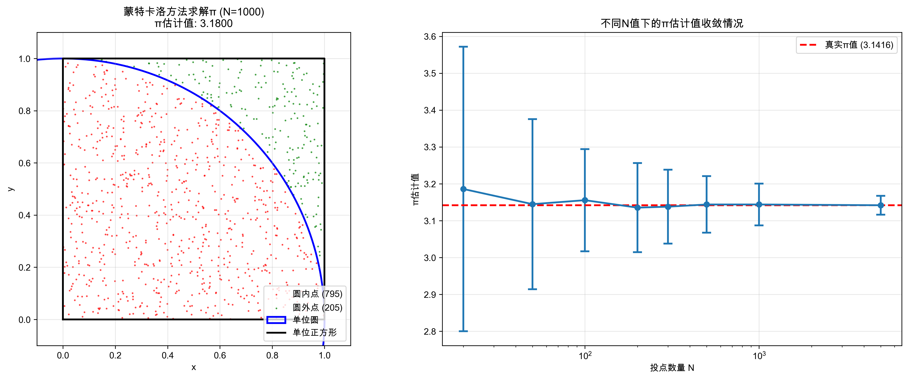
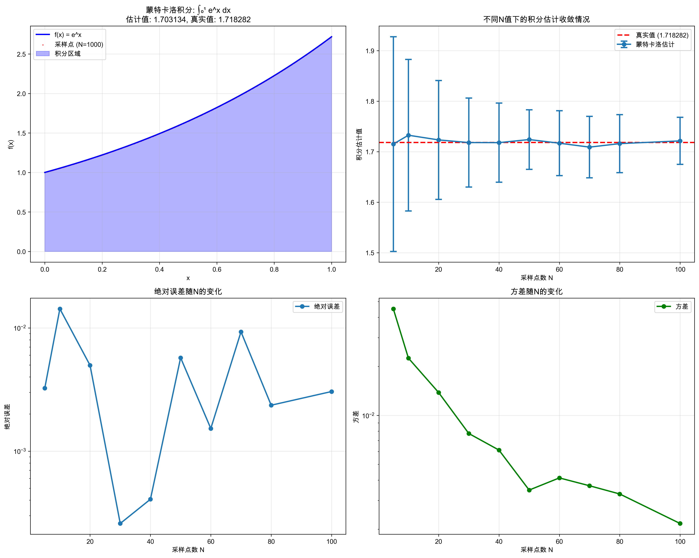
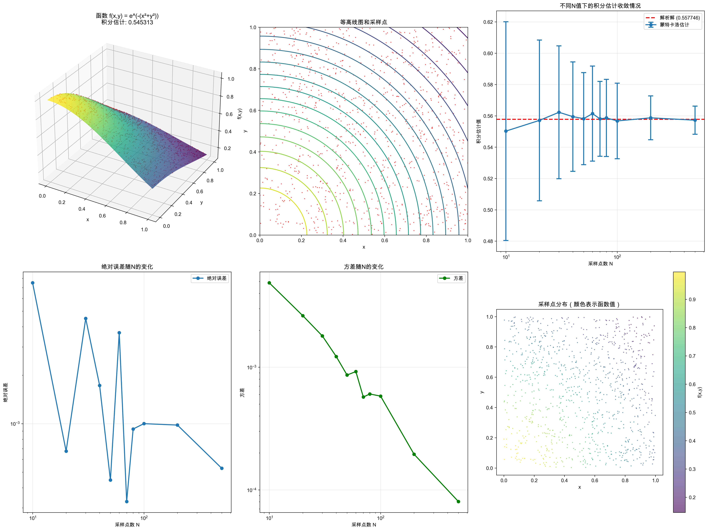
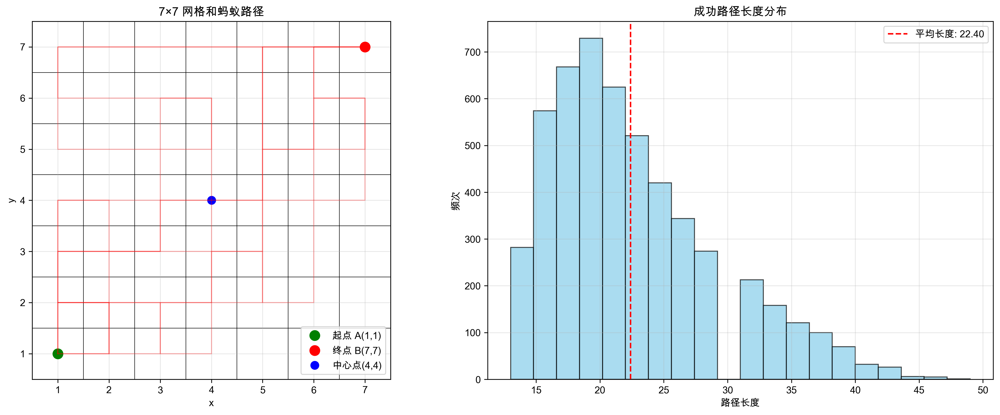
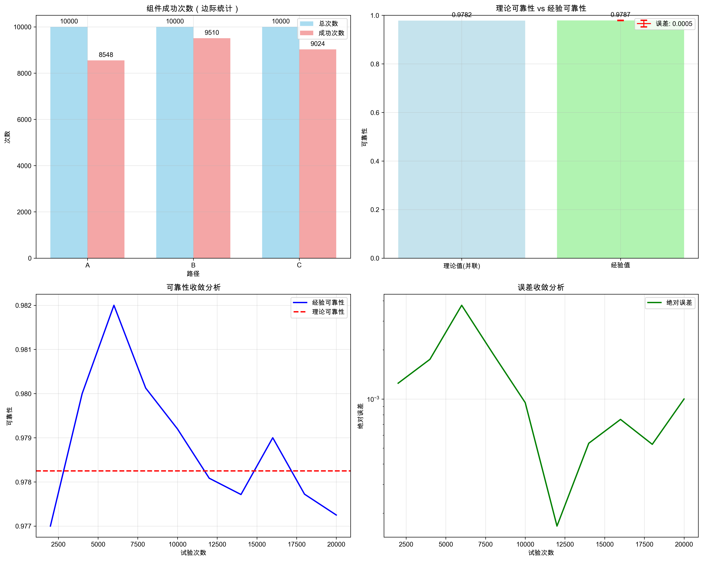

# 机器学习与数据挖掘 作业一 实验报告

- 学生：梁力航
- 学号：23336128

---

## 报告说明
本报告基于 `23336128梁力航作业一/` 中五个实验（q1–q5），统一从实验目的、理论与方法、实现与运行、结果与可视化、分析与结论五个方面进行阐述，并在每节末尾给出可复现实验的运行方式与输出文件说明。

---

## 实验一（q1）：蒙特卡洛方法求解 π

### 1. 实验目的
- 通过蒙特卡洛随机投点方法估计 π 的值，理解蒙特卡洛法的基本思想与收敛性特征。

### 2. 理论与方法
- 在单位正方形内随机均匀采样 N 个点，统计落在单位圆内的点数 m。
- 根据面积比例关系：π ≈ 4 × (m / N)。
- 随 N 增大，估计值按 O(1/√N) 收敛。

### 3. 实现与运行
- 主要文件：`q1/monte_carlo_pi.py`
- 依赖安装：`pip install -r q1/requirements.txt`
- 运行：`python q1/monte_carlo_pi.py`
- 功能：
  - 对 N = 20, 50, 100, 200, 300, 500, 1000, 5000 进行采样；每个 N 重复 100 次。
  - 输出均值、方差；保存 CSV 和可视化 PNG。

### 4. 结果与可视化
- 结果文件：`q1/monte_carlo_results.csv`
- 图像：`q1/monte_carlo_visualization.png`
- 插图：
- 现象：随着 N 增大，π 的估计更接近 3.14159，方差下降，点云更密集地逼近单位圆。

### 5. 分析与结论
- 蒙特卡洛法对 π 的估计无偏，但方差收敛较慢（O(1/√N)）。
- 提高精度需显著增大样本量；可考虑方差缩减技术以提升效率。

### 6. 可复现性
- 运行命令：`python q1/monte_carlo_pi.py`
- 核心输出：CSV 统计与 PNG 可视化。

---

## 实验二（q2）：蒙特卡洛方法求 ∫₀¹ e^x dx

### 1. 实验目的
- 使用蒙特卡洛积分估计 ∫₀¹ e^x dx（解析值 e−1），比较均匀采样与重要性采样的差异。

### 2. 理论与方法
- 均匀采样：I ≈ (1/N) Σ e^{x_i}, x_i ~ U(0,1)。
- 重要性采样：选取与 e^x 形状更匹配的采样分布，使用加权无偏估计以降低方差。
- 评估指标：均值、方差、绝对误差、相对误差随 N 的变化。

### 3. 实现与运行
- 主要文件：`q2/monte_carlo_integration.py`
- 依赖安装：`pip install -r q2/requirements.txt`
- 运行：`python q2/monte_carlo_integration.py`
- 功能：
  - N = 5,10,20,30,40,50,60,70,80,100；每个 N 重复 100 次。
  - 对比均匀采样与重要性采样；输出统计与多子图可视化。

### 4. 结果与可视化
- 结果文件：`q2/monte_carlo_integration_results.csv`
- 图像：`q2/monte_carlo_integration_visualization.png`
- 插图：
- 现象：随 N 增大，估计趋近 e−1；重要性采样在同样 N 下通常表现出更低方差和更稳定的估计。

### 5. 分析与结论
- 均匀采样简单但方差较大；重要性采样能显著降低方差，提高样本效率。
- 实验验证了方差缩减方法在蒙特卡洛积分中的优势。

### 6. 可复现性
- 运行命令：`python q2/monte_carlo_integration.py`
- 核心输出：CSV 统计与 PNG 可视化。

---

## 实验三（q3）：蒙特卡洛方法求二重积分 ∫₀¹∫₀¹ e^{-(x²+y²)} dx dy

### 1. 实验目的
- 通过二维均匀采样估计二重积分值，并与解析解（基于误差函数）对比。

### 2. 理论与方法
- 采样 (x_i,y_i) ~ U([0,1]^2)，估计 I ≈ (1/N) Σ e^{-(x_i²+y_i²)}。
- 解析解：I = (∫₀¹ e^{-x²} dx)^2 = ((√π/2)·erf(1))^2。
- 比较均匀采样与重要性采样的方差差异。

### 3. 实现与运行
- 主要文件：`q3/monte_carlo_double_integration.py`
- 依赖安装：`pip install -r q3/requirements.txt`
- 运行：`python q3/monte_carlo_double_integration.py`
- 功能：
  - N = 10,20,30,40,50,60,70,80,100,200,500；每个 N 重复 100 次。
  - 计算解析解并与估计对比；输出误差、方差、收敛曲线等图表。

### 4. 结果与可视化
- 结果文件：`q3/monte_carlo_double_integration_results.csv`
- 图像：`q3/monte_carlo_double_integration_visualization.png`
- 插图：
- 现象：随维度上升，方差更敏感；足够大的 N 下估计与解析解吻合良好。

### 5. 分析与结论
- 二维积分的蒙特卡洛仍以 O(1/√N) 收敛，但为了达到相同精度需更大样本。
- 重要性采样在二维情形下同样能有效降低方差。

### 6. 可复现性
- 运行命令：`python q3/monte_carlo_double_integration.py`
- 核心输出：CSV 统计与 PNG 可视化。

---

## 实验四（q4）：蚂蚁路径寻找的蒙特卡洛仿真（7×7网格）

### 1. 实验目的
- 在访问约束与中心点特殊规则下，估计从 A(1,1) 到 B(7,7) 的成功到达概率，分析路径特性。

### 2. 问题与方法
- 网格 7×7；允许上下左右移动；除中心 (4,4) 外各点最多访问 1 次，中心最多 2 次。
- 蒙特卡洛仿真：多次随机游走，统计成功率与路径统计特征。

### 3. 实现与运行
- 主要文件：`q4/ant_pathfinding.py`
- 依赖安装：`pip install -r q4/requirements.txt`
- 运行：`python q4/ant_pathfinding.py`
- 功能：
  - 进行 20,000 次仿真；验证每步移动有效性与约束。
  - 输出成功概率、路径长度分布、中心点访问次数、方向偏好等。

### 4. 结果与可视化
- 结果文件：`q4/ant_pathfinding_results.csv`
- 图像：`q4/ant_pathfinding_visualization.png`
- 插图：
- 示意图：
- 现象：成功率随约束与路径复杂性影响；路径长度分布呈一定扩散，中心点访问具有显著性。

### 5. 分析与结论
- 约束导致可行路径数减少；随机策略下成功概率有限。
- 可通过启发式或策略改进（如偏向目标方向的决策）提升成功率。

### 6. 可复现性
- 运行命令：`python q4/ant_pathfinding.py`
- 核心输出：CSV 统计与 PNG 可视化。

---

## 实验五（q5）：分立部件系统可靠性的蒙特卡洛仿真

### 1. 实验目的
- 针对含并联与串联混合结构的系统，估计系统可靠性并与理论计算对比。

### 2. 系统模型与理论
- 结构：输入 → 两条并行路径 → 输出；路径1为 A（单元）；路径2为 B 串联 C。
- 组件可靠性：A=0.85，B=0.95，C=0.90；路径选择概率各 0.5。
- 理论可靠性：R_sys = 0.5×0.85 + 0.5×0.95×0.90 = 0.8525（85.25%）。

### 3. 实现与运行
- 主要文件：`q5/system_reliability.py`
- 依赖安装：`pip install -r q5/requirements.txt`
- 运行：`python q5/system_reliability.py`
- 功能：
  - 进行 10,000 次试验；按路径选择与组件成败判定系统成败。
  - 输出经验可靠性、误差、收敛曲线、路径与组件统计。

### 4. 结果与可视化
- 结果文件：`q5/system_reliability_results.csv`
- 图像：`q5/system_reliability_visualization.png`
- 插图：
- 示意图：
- 现象：经验值随试验次数增加逼近理论 85.25%，误差收敛；路径比例与假设一致。

### 5. 分析与结论
- 蒙特卡洛仿真验证了理论可靠性；试验次数增大可降低估计方差。
- 若路径选择或组件可靠性分布改变，可用相同框架快速复用评估。

### 6. 可复现性
- 运行命令：`python q5/system_reliability.py`
- 核心输出：CSV 统计与 PNG 可视化。

---

## 总结
- 五个实验均验证了蒙特卡洛方法在估计数值、概率与系统性能上的通用性与有效性。
- 关键结论：
  - 收敛速度受限于 O(1/√N)，方差缩减方法能显著提升效率。
  - 解析解可作为基准验证；仿真结果与理论一致性良好。
  - 在复杂路径与系统结构问题中，蒙特卡洛提供了灵活且可扩展的估计框架。
