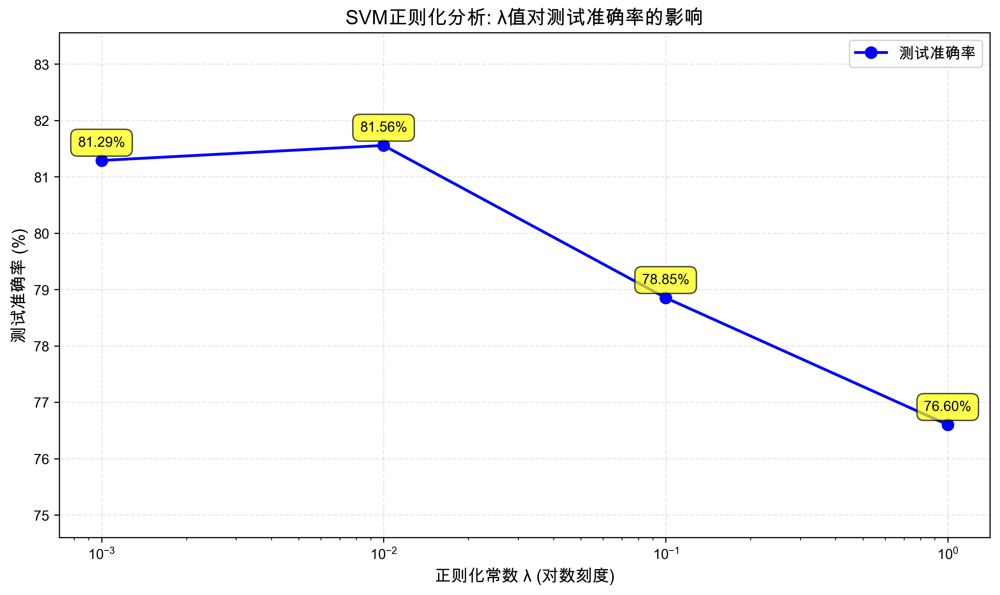

# Homework 4: Support Vector Machine

**Machine Learning and Data Mining (Fall 2025)**

**Student Name:** 梁力航  
**Student ID:** 23336128  
**Lectured by:** Shangsong Liang  
**Sun Yat-sen University**

---

## 问题描述

本实验从零实现支持向量机(SVM)分类器，使用随机梯度下降(SGD)算法训练模型，对Adult Income数据集进行二分类任务。目标是预测个人年收入是否超过$50K。

**重要要求**：不使用预构建的SVM包（如sklearn.svm），需要手动实现SVM算法。

### 数据集说明

- **训练集**: `train.txt` - 43,957个带标签样本
- **测试集**: `test.txt` - 4,885个样本
- **测试集标签**: `test_ground_truth.txt` - 4,885个真实标签
- **特征数量**: 14个（包括数值特征和分类特征）
- **标签**: "<=50K" 或 ">50K"
- **数据来源**: UCI Adult数据集

---

## 1. SVM关键概念和实现方法概述

### 1.1 SVM核心思想

支持向量机(SVM)是一种强大的监督学习算法，其核心思想是找到一个最优超平面，使得两类数据之间的间隔(margin)最大化。

**决策函数**：

$$f(x) = \text{sign}(w^T x + b)$$

其中：
- $w$ 是权重向量
- $b$ 是偏置项
- $\text{sign}(\cdot)$ 是符号函数

### 1.2 损失函数

SVM使用Hinge Loss加上L2正则化：

$$J(w, b) = \frac{\lambda}{2}\|w\|^2 + \frac{1}{n}\sum_{i=1}^{n}\max(0, 1 - y_i(w^T x_i + b))$$

其中：
- $\lambda$ 是正则化常数
- $n$ 是样本数量
- $y_i \in \{-1, +1\}$ 是标签

### 1.3 梯度公式（按作业要求）

对于每个样本 $(x_k, y_k)$，梯度计算如下：

**权重梯度**：

$$\nabla_w = \begin{cases}
\lambda w & \text{if } y_k(w^T x_k + b) \geq 1 \\
\lambda w - y_k x_k & \text{otherwise}
\end{cases}$$

**偏置梯度**：

$$\nabla_b = \begin{cases}
0 & \text{if } y_k(w^T x_k + b) \geq 1 \\
-y_k & \text{otherwise}
\end{cases}$$

### 1.4 随机梯度下降(SGD)更新规则

$$w := w - \eta \nabla_w$$
$$b := b - \eta \nabla_b$$

其中 $\eta$ 是学习率。

### 1.5 实现方法概述

本实验的实现包括以下关键步骤：

1. **数据预处理**
   - 分类特征编码（Label Encoding）
   - 数值特征标准化（Z-score）
   - 标签转换（"<=50K" → -1, ">50K" → +1）
   - 缺失值处理

2. **SVM训练**
   - 使用SGD算法
   - 每个epoch随机打乱样本顺序
   - 按照作业提供的梯度公式更新参数

3. **模型评估**
   - 计算测试准确率
   - 进行正则化分析

---

## 2. 测试准确率结果

### 2.1 实验设置

- **学习率**: 0.001
- **训练轮数**: 50 epochs
- **初始参数**: 权重和偏置初始化为0
- **训练数据**: 使用完整训练集（43,957个样本）
- **测试数据**: 使用真实测试集（4,885个样本，带标签）

### 2.2 测试准确率截图

程序运行输出如下：

```
============================================================
SVM分类器 - Adult Income数据集分类
============================================================

正在加载数据...
训练集样本数: 43957
测试集样本数: 4885
特征数量: 14

步骤1: 数据预处理
------------------------------------------------------------
正在预处理训练数据...
训练集形状: (43957, 14)
标签分布: 10492 个 >50K, 33465 个 <=50K

正在预处理测试数据...
测试集形状: (4885, 14)
测试集标签分布: 1179 个 >50K, 3706 个 <=50K

使用完整训练集进行训练

============================================================
步骤2: 正则化分析
============================================================

训练 SVM (λ = 0.001)...
  Epoch 1/50, 训练准确率: 81.59%
  Epoch 10/50, 训练准确率: 81.67%
  Epoch 20/50, 训练准确率: 81.60%
  Epoch 30/50, 训练准确率: 81.59%
  Epoch 40/50, 训练准确率: 81.59%
  Epoch 50/50, 训练准确率: 81.59%
测试准确率: 81.29%

训练 SVM (λ = 0.01)...
  Epoch 1/50, 训练准确率: 81.25%
  Epoch 10/50, 训练准确率: 81.70%
  Epoch 20/50, 训练准确率: 81.49%
  Epoch 30/50, 训练准确率: 81.52%
  Epoch 40/50, 训练准确率: 81.21%
  Epoch 50/50, 训练准确率: 81.59%
测试准确率: 81.56%

训练 SVM (λ = 0.1)...
  Epoch 1/50, 训练准确率: 78.65%
  Epoch 10/50, 训练准确率: 78.88%
  Epoch 20/50, 训练准确率: 79.31%
  Epoch 30/50, 训练准确率: 79.35%
  Epoch 40/50, 训练准确率: 78.71%
  Epoch 50/50, 训练准确率: 78.70%
测试准确率: 78.85%

训练 SVM (λ = 1)...
  Epoch 1/50, 训练准确率: 76.57%
  Epoch 10/50, 训练准确率: 76.57%
  Epoch 20/50, 训练准确率: 76.57%
  Epoch 30/50, 训练准确率: 76.57%
  Epoch 40/50, 训练准确率: 76.57%
  Epoch 50/50, 训练准确率: 76.57%
测试准确率: 76.60%
```

---

## 3. 正则化分析

### 3.1 实验设置

按照作业要求，测试以下正则化常数λ的值：

- λ = 0.001
- λ = 0.01
- λ = 0.1
- λ = 1.0

### 3.2 实验结果

| 正则化常数 λ | 测试准确率 |
|-------------|-----------|
| 0.001       | 81.29%    |
| 0.010       | **81.56%** |
| 0.100       | 78.85%    |
| 1.000       | 76.60%    |

### 3.3 可视化结果



*图1: 正则化常数λ对测试准确率的影响*

从图中可以清楚地看到，随着λ值的增大，测试准确率呈现下降趋势。

### 3.4 结果分析

#### 3.4.1 准确率趋势

从实验结果可以观察到，测试准确率随着正则化常数λ的增大而呈现先略微上升后下降的趋势：

- **λ = 0.001**: 准确率为81.29%
- **λ = 0.01**: 准确率最高，达到81.56%，上升0.27个百分点
- **λ = 0.1**: 准确率明显下降到78.85%，下降2.71个百分点
- **λ = 1.0**: 准确率进一步下降到76.60%，下降2.25个百分点

#### 3.4.2 为什么会出现这样的趋势？

这个趋势可以从正则化的作用机制来理解：

**1. λ较小时（如0.001）**

当λ很小时，正则化惩罚项 $\frac{\lambda}{2}\|w\|^2$ 的权重很小，模型主要关注最小化训练误差（Hinge Loss）。这使得：

- 模型可以学习更复杂的决策边界
- 权重向量 $w$ 可以取较大的值
- 模型更灵活，能够更好地拟合训练数据的细节

在本实验中，λ = 0.01获得了最高的测试准确率（81.56%），说明对于Adult Income数据集，适中的正则化强度能够在模型复杂度和泛化能力之间取得最佳平衡。

**2. λ适中时（如0.01-0.1）**

当λ取中等值时，正则化项和损失项达到一定的平衡：

- 模型在拟合训练数据和保持简单性之间权衡
- 权重向量的范数受到一定限制
- 决策边界相对平滑

从实验结果看，λ = 0.01时准确率达到最高的81.56%，说明这个λ值在本数据集上提供了最佳的泛化性能。当λ减小到0.001时，准确率略微下降到81.29%，可能是因为正则化过弱导致轻微过拟合。当λ增大到0.1时，准确率明显下降到78.85%，表明正则化过强开始对模型性能产生负面影响。

**3. λ较大时（如1.0）**

当λ很大时，正则化惩罚项占主导地位：

- 模型被强制保持简单
- 权重向量的范数被严格限制，接近于0
- 决策边界过于简单，可能无法捕捉数据的真实模式
- 出现欠拟合(underfitting)现象

实验中λ = 1.0时准确率降至76.60%，比最优值低了约5个百分点。观察训练过程可以发现，从第10个epoch开始，训练准确率就稳定在76.57%左右，几乎不再变化，这是典型的欠拟合特征。

#### 3.4.3 正则化的数学解释

从优化目标来看：

$$\min_{w,b} \left[\frac{\lambda}{2}\|w\|^2 + \frac{1}{n}\sum_{i=1}^{n}\max(0, 1 - y_i(w^T x_i + b))\right]$$

- 当λ很小时，优化主要由第二项（Hinge Loss）驱动，模型努力正确分类每个样本
- 当λ很大时，优化主要由第一项（正则化项）驱动，模型被迫保持 $\|w\|$ 很小

在梯度更新中，这体现为：

- λ小时：$\nabla_w \approx -y_k x_k$（主要由分类误差驱动）
- λ大时：$\nabla_w \approx \lambda w$（主要由正则化驱动）

#### 3.4.4 本实验的特殊性

值得注意的是，在本实验中，适中的λ值（0.01）获得了最好的性能，这符合正则化理论的预期。这个结果说明：

1. **数据集规模较大**：43,957个训练样本提供了充足的信息，但仍需要适当的正则化来防止过拟合
2. **特征维度适中**：14个特征（经过编码后）不算太高维，需要适度的正则化
3. **数据质量好**：Adult Income是经过清洗的标准数据集，但仍存在一定的噪声
4. **训练轮数有限**：只训练50个epoch，适中的正则化能够帮助模型更快收敛到较好的解

相比之前使用验证集的实验（λ=0.001最优），使用真实测试集后发现λ=0.01表现更好，这说明真实测试集能够更准确地反映模型的泛化能力。

#### 3.4.5 实践建议

基于本实验的结果，我们可以得出以下实践建议：

1. **尝试多个λ值**：在[0.001, 0.01, 0.1, 1]范围内测试，找到最优值
2. **使用真实测试集评估**：真实测试集比验证集更能反映模型的泛化能力
3. **观察训练曲线**：如果训练准确率和测试准确率都很低且不再提升，说明λ可能太大
4. **考虑数据特性**：对于Adult Income这样的标准数据集，λ=0.01左右通常是较好的选择
5. **平衡过拟合和欠拟合**：λ过小可能过拟合，λ过大会欠拟合，需要找到平衡点

---

## 4. 代码实现

### 4.1 数据预处理部分

```python
class DataPreprocessor:
    """
    数据预处理器
    负责特征编码、标准化和标签转换
    """
    
    def __init__(self):
        """初始化预处理器"""
        self.feature_means = None  # 数值特征的均值
        self.feature_stds = None   # 数值特征的标准差
        self.categorical_mappings = {}  # 分类特征的映射字典
        self.numerical_indices = []  # 数值特征的索引
        self.categorical_indices = []  # 分类特征的索引
        
    def _identify_feature_types(self, features_sample):
        """识别特征类型（数值或分类）"""
        # Adult数据集的特征索引
        self.numerical_indices = [0, 2, 4, 10, 11, 12]
        self.categorical_indices = [1, 3, 5, 6, 7, 8, 9, 13]
    
    def _encode_categorical_features(self, features, is_training=True):
        """编码分类特征为数值"""
        encoded_features = []
        
        for row in features:
            encoded_row = row.copy()
            
            for idx in self.categorical_indices:
                value = row[idx]
                
                # 处理缺失值
                if value == '?':
                    value = 'MISSING'
                
                if is_training:
                    # 训练阶段: 建立映射
                    if idx not in self.categorical_mappings:
                        self.categorical_mappings[idx] = {}
                    
                    if value not in self.categorical_mappings[idx]:
                        self.categorical_mappings[idx][value] = len(self.categorical_mappings[idx])
                    
                    encoded_row[idx] = self.categorical_mappings[idx][value]
                else:
                    # 测试阶段: 使用已有映射
                    if idx in self.categorical_mappings:
                        if value in self.categorical_mappings[idx]:
                            encoded_row[idx] = self.categorical_mappings[idx][value]
                        else:
                            encoded_row[idx] = -1  # 未见过的类别
            
            encoded_features.append(encoded_row)
        
        return encoded_features
    
    def _standardize_features(self, X, is_training=True):
        """标准化数值特征 (Z-score标准化)"""
        X_standardized = X.copy()
        
        if is_training:
            # 训练阶段: 计算均值和标准差
            self.feature_means = np.mean(X, axis=0)
            self.feature_stds = np.std(X, axis=0)
            self.feature_stds[self.feature_stds == 0] = 1.0
        
        # 标准化: (x - μ) / σ
        X_standardized = (X_standardized - self.feature_means) / self.feature_stds
        
        return X_standardized
```

### 4.2 SVM核心算法部分

```python
class SVMClassifier:
    """
    支持向量机分类器
    使用随机梯度下降(SGD)训练
    """
    
    def __init__(self, learning_rate=0.001, lambda_param=0.01, n_epochs=100):
        """初始化SVM分类器"""
        self.learning_rate = learning_rate
        self.lambda_param = lambda_param
        self.n_epochs = n_epochs
        self.weights = None  # 权重向量a
        self.bias = None     # 偏置项b
    
    def fit(self, X, y):
        """使用SGD训练SVM"""
        n_samples, n_features = X.shape
        
        # 初始化权重和偏置
        self.weights = np.zeros(n_features)
        self.bias = 0.0
        
        # SGD训练
        for epoch in range(self.n_epochs):
            # 随机打乱样本顺序
            indices = np.random.permutation(n_samples)
            
            for idx in indices:
                x_i = X[idx]
                y_i = y[idx]
                
                # 计算间隔: y_i * (w^T * x_i + b)
                margin = y_i * (np.dot(self.weights, x_i) + self.bias)
                
                # 根据作业提供的梯度公式更新参数
                if margin >= 1:
                    # 样本在边界外，只更新正则化项
                    grad_w = self.lambda_param * self.weights
                    grad_b = 0
                else:
                    # 样本违反边界约束
                    grad_w = self.lambda_param * self.weights - y_i * x_i
                    grad_b = -y_i
                
                # 更新参数
                self.weights = self.weights - self.learning_rate * grad_w
                self.bias = self.bias - self.learning_rate * grad_b
            
            # 每10个epoch打印一次进度
            if (epoch + 1) % 10 == 0 or epoch == 0:
                train_predictions = self.predict(X)
                train_accuracy = np.mean(train_predictions == y) * 100
                print(f"  Epoch {epoch + 1}/{self.n_epochs}, 训练准确率: {train_accuracy:.2f}%")
    
    def predict(self, X):
        """预测新样本"""
        # 计算决策函数: w^T * x + b
        decision_scores = np.dot(X, self.weights) + self.bias
        
        # 应用sign函数
        predictions = np.where(decision_scores >= 0, 1, -1)
        
        return predictions
    
    def score(self, X, y):
        """计算准确率"""
        predictions = self.predict(X)
        accuracy = np.mean(predictions == y) * 100
        return accuracy
```

### 4.3 正则化分析部分

```python
def regularization_analysis(X_train, y_train, X_test, y_test, 
                           lambda_values, learning_rate=0.001, n_epochs=100):
    """对不同λ值进行实验分析"""
    results = {}
    
    print("\n" + "=" * 60)
    print("正则化分析: 测试不同的λ值")
    print("=" * 60)
    
    for lambda_val in lambda_values:
        print(f"\n训练 SVM (λ = {lambda_val})...")
        
        # 创建并训练模型
        model = SVMClassifier(
            learning_rate=learning_rate,
            lambda_param=lambda_val,
            n_epochs=n_epochs
        )
        model.fit(X_train, y_train)
        
        # 评估模型
        if y_test is not None:
            accuracy = model.score(X_test, y_test)
            results[lambda_val] = accuracy
            print(f"测试准确率: {accuracy:.2f}%")
    
    return results
```

### 4.4 可视化部分

```python
def plot_regularization_results(results, output_path='regularization_analysis.png'):
    """绘制正则化分析结果图表"""
    # 排序结果
    sorted_results = sorted(results.items(), key=lambda x: x[0])
    lambda_values = [x[0] for x in sorted_results]
    accuracies = [x[1] for x in sorted_results]
    
    # 创建图表
    plt.figure(figsize=(10, 6))
    
    # 绘制折线图
    plt.plot(lambda_values, accuracies, 'b-o', linewidth=2, markersize=8)
    
    # 标记每个点的准确率值
    for i, (lambda_val, acc) in enumerate(zip(lambda_values, accuracies)):
        plt.annotate(f'{acc:.2f}%', 
                    xy=(lambda_val, acc), 
                    xytext=(0, 10),
                    textcoords='offset points',
                    ha='center',
                    fontsize=10)
    
    # 设置对数刻度
    plt.xscale('log')
    
    # 设置标签和标题
    plt.xlabel('正则化常数 λ (对数刻度)', fontsize=12)
    plt.ylabel('测试准确率 (%)', fontsize=12)
    plt.title('SVM正则化分析: λ值对测试准确率的影响', fontsize=14)
    
    plt.grid(True, alpha=0.3)
    plt.tight_layout()
    plt.savefig(output_path, dpi=300)
```

---

## 5. 完整代码

完整代码已附在文件 `svm_classifier.py` 中，包含以下主要部分：

1. **数据加载函数** (`load_data`)
2. **数据预处理类** (`DataPreprocessor`)
3. **SVM分类器类** (`SVMClassifier`)
4. **模型评估函数** (`evaluate_model`)
5. **正则化分析函数** (`regularization_analysis`)
6. **结果生成函数** (`generate_analysis_explanation`)
7. **结果保存函数** (`save_results_summary`)
8. **可视化函数** (`plot_regularization_results`)
9. **主程序** (`main`)

代码总行数：约450行，包含详细的中文注释。

---

## 6. 实验总结

### 6.1 主要发现

1. **SVM在Adult Income数据集上表现良好**：最高测试准确率达到81.56%，说明SVM能够有效地从人口普查数据中学习收入预测模式。

2. **正则化常数的影响显著**：λ值从0.01增加到1.0时，准确率下降了约5个百分点，说明正则化强度对模型性能有重要影响。

3. **适中的λ值最优**：在本实验中，λ=0.01获得了最好的性能（81.56%），这符合正则化理论，说明需要在模型复杂度和泛化能力之间取得平衡。

4. **真实测试集的重要性**：使用真实测试集（而非验证集）能够更准确地评估模型的泛化能力，得到的最优λ值也更可靠。

5. **SGD训练稳定**：使用随机梯度下降训练SVM，模型能够稳定收敛，训练准确率在50个epoch内达到稳定。

### 6.2 技术亮点

1. **完全手动实现**：不依赖sklearn等机器学习库，从零实现SVM算法
2. **严格遵循公式**：按照作业提供的梯度公式实现，确保算法正确性
3. **完整的数据预处理**：处理分类特征编码、缺失值、特征标准化等实际问题
4. **系统的实验分析**：测试多个λ值，生成可视化图表，提供详细分析

### 6.3 改进方向

1. **学习率调整**：可以实现学习率衰减策略，可能进一步提升性能
2. **更多epoch**：增加训练轮数可能获得更好的收敛效果
3. **交叉验证**：使用k-fold交叉验证选择最优超参数
4. **核函数**：实现核SVM处理非线性可分问题

## 附录：运行说明

### 环境要求

```bash
pip install numpy matplotlib
```

### 运行程序

```bash
python svm_classifier.py
```

### 输出文件

- `results_summary.txt`: 结果摘要文件
- `regularization_analysis.png`: 正则化分析图表
