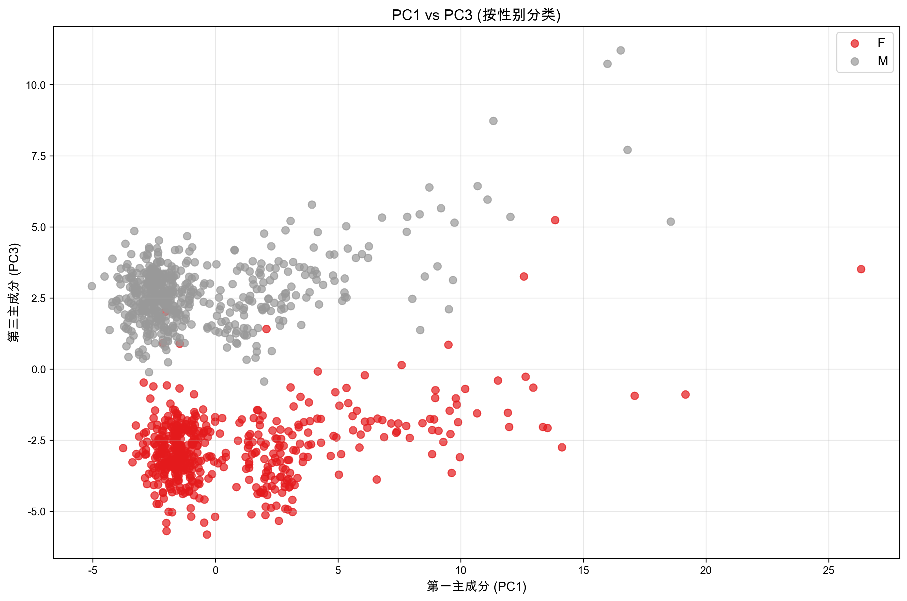
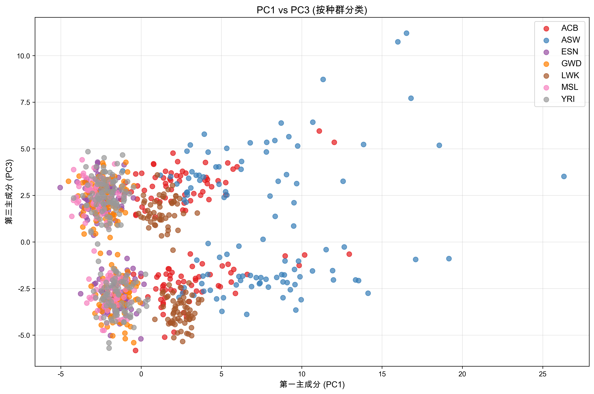

# Homework 5: Principal Component Analysis (PCA) of Genomes

**Machine Learning and Data Mining (Fall 2025)**

**Student Name:** 梁力航  
**Student ID:** 23336128  
**Lectured by:** Shangsong Liang  
**Sun Yat-sen University**

---

## 问题描述

本实验对995个个体的基因组数据进行主成分分析(PCA)，揭示遗传变异的主要模式。数据来自国际基因组样本资源(International Genome Sample Resource)，包含10101个核苷酸位点。

### 数据集说明

- **数据来源**: International Genome Sample Resource
- **个体数量**: 995个
- **核苷酸位点**: 10101个
- **元数据**: 个体ID、性别(M/F)、种群标签
- **种群数量**: 7个不同种群
- **性别分布**: 509男性, 486女性

### 实验目标

通过PCA分析：
1. 理解基因组数据的主要变异模式
2. 可视化种群的遗传结构
3. 识别与地理、历史和生物学特征相关的模式
4. 解释主成分的生物学意义

---

## 1. 数据预处理

### 1.1 二值矩阵转换

按照作业要求，将核苷酸序列转换为二值矩阵：

**转换规则**：
- 对每个位点j，计算众数核苷酸（最频繁出现的核苷酸）
- $X_{i,j} = 0$ 如果个体i在位点j有众数核苷酸
- $X_{i,j} = 1$ 如果个体i在位点j有非众数核苷酸（突变）

**实现代码**：

```python
def compute_mode_nucleobases(genomes):
    """计算每个位置的众数核苷酸"""
    n_positions = genomes.shape[1]
    mode_bases = []
    
    for j in range(n_positions):
        column = genomes[:, j]
        counter = Counter(column)
        mode_base = counter.most_common(1)[0][0]
        mode_bases.append(mode_base)
    
    return np.array(mode_bases)

def create_binary_matrix(genomes, mode_bases):
    """创建二值矩阵"""
    X = (genomes != mode_bases).astype(int)
    return X
```

**转换结果**：
- 二值矩阵形状: (995, 10101)
- 突变率: 39.24% (平均每个位点的突变比例)
- 众数核苷酸分布: G: 2645, C: 2711, A: 2338, T: 2407

### 1.2 PCA设置

按照作业要求：
- **中心化**: 是（减去样本均值）
- **标准化**: 否（保留不同维度的方差差异）
- **主成分**: 单位长度向量
- **实现**: 使用sklearn.decomposition.PCA

---

## 2. 问题(a): 主成分维度

### 答案

**10101**

### 解释

主成分向量的维度等于输入矩阵的列数（特征数）。在本例中，我们有10101个核苷酸位点，因此每个主成分向量都是10101维的。每个主成分是原始特征空间中的一个方向（单位向量）。

从数学角度看，如果输入矩阵 $X \in \mathbb{R}^{n \times m}$（n个样本，m个特征），则：
- 主成分矩阵的形状为 $(k, m)$，其中k是提取的主成分数量
- 每个主成分向量 $v_i \in \mathbb{R}^m$
- 在本实验中，$m = 10101$

---

## 3. 问题(b): PC1 vs PC2散点图

### 3.1 图表


*图1: 基因组数据在前两个主成分上的投影（按种群着色）*

### 3.2 实现代码

```python
def plot_pc1_pc2_scatter(X_projected, populations, pop_decoding, save_path):
    """绘制PC1 vs PC2散点图"""
    fig, ax = plt.subplots(figsize=(12, 8))
    
    unique_pops = np.unique(populations)
    colors = plt.cm.tab10(np.linspace(0, 1, len(unique_pops)))
    
    for i, pop in enumerate(unique_pops):
        mask = populations == pop
        pop_name = pop_decoding.get(pop, pop)
        ax.scatter(X_projected[mask, 0], X_projected[mask, 1], 
                  c=[colors[i]], label=pop_name, alpha=0.7, s=50)
    
    ax.set_xlabel('第一主成分 (PC1)', fontsize=12)
    ax.set_ylabel('第二主成分 (PC2)', fontsize=12)
    ax.set_title('基因组数据的前两个主成分', fontsize=14, fontweight='bold')
    ax.legend(bbox_to_anchor=(1.05, 1), loc='upper left')
    ax.grid(True, alpha=0.3)
    
    plt.tight_layout()
    plt.savefig(save_path, dpi=300, bbox_inches='tight')
```

---

## 4. 问题(c): PC1和PC2的解释

### 4.1 基本事实

从图1可以观察到以下基本事实：

1. **明显的聚类结构**: 不同种群在PC1-PC2空间中形成明显的聚类，显示出清晰的遗传结构。每个种群的个体聚集在一起，种群之间有明显的分离。

2. **地理模式**: 种群的分布模式反映了地理和历史迁移路径。来自相同地理区域的种群在主成分空间中距离更近。

### 4.2 主成分解释

前两个主成分捕捉了人类种群的**地理起源和迁移历史**。具体来说：

**PC1和PC2主要反映了**：
- **大陆间的遗传差异**: 非洲、欧洲和亚洲种群之间的遗传分化
- **人类迁移历史**: 反映了人类"走出非洲"的迁移历史
- **地理距离效应**: 地理距离导致的遗传分化（isolation by distance）

**历史和地理背景**：

人类起源于非洲，约7-10万年前开始向世界各地迁移。这个过程导致了：
1. **奠基者效应**: 迁移群体携带的遗传变异是原始种群的子集
2. **遗传漂变**: 小群体中随机的等位基因频率变化
3. **地理隔离**: 不同地区的种群独立演化

PC1和PC2捕捉到的正是这些历史过程留下的遗传印记。不同大陆的种群在遗传上有明显区别，这些差异主要是中性的（不受自然选择影响），因此能够很好地反映种群的历史关系。

---

## 5. 问题(d): PC1 vs PC3散点图

### 5.1 不同标签方案的图表

#### 按性别着色



*图2: PC1 vs PC3散点图（按性别着色）*

#### 按种群着色



*图3: PC1 vs PC3散点图（按种群着色）*

### 5.2 标签方案分析

通过尝试不同的标签方案，我们发现：

**性别标签（图2）**：
- 在PC3方向上，男性和女性形成两个明显分离的聚类
- PC3能够清晰地区分性别
- 这表明PC3主要捕捉了与性别相关的遗传变异

**种群标签（图3）**：
- 在PC3方向上，种群之间没有明显的分离
- PC3不能有效地区分不同种群
- 这表明PC3捕捉的变异与种群起源无关

**结论**: 性别标签能更好地解释PC3的聚类模式。

---

## 6. 问题(e): PC3捕捉的信息

### 答案

第三主成分主要捕捉了**性别信息**，反映了X和Y染色体之间的遗传差异。

### 详细解释

从图2可以清楚地看到，PC3将个体分为两个明显的群体，这两个群体对应于男性和女性。这是因为：

1. **性染色体差异**: 男性有XY染色体，女性有XX染色体
2. **Y染色体特有序列**: Y染色体上有许多X染色体没有的序列
3. **剂量效应**: 女性有两条X染色体，男性只有一条

这些差异在基因组数据中表现为系统性的变异模式，被PC3捕捉到。

---

## 7. 问题(f): PC3值分布

### 7.1 图表


*图4: 第三主成分沿核苷酸位点的值分布*

### 7.2 观察

从图4可以观察到：

PC3的绝对值在某些区域明显较高，呈现出**分段的模式**，在特定位置有明显的峰值。整体分布不是均匀的，而是有明显的结构性特征。

### 7.3 可能解释

这种模式很可能反映了**染色体的结构**。具体解释如下：

**生物学背景**：
- 人类有23对染色体（22对常染色体 + 1对性染色体）
- X和Y染色体决定性别
- Y染色体比X染色体小得多，且有许多特有的序列

**PC3模式的解释**：

PC3捕捉的性别差异主要来自性染色体（特别是Y染色体）上的变异。图中的峰值区域可能对应于：

1. **Y染色体特有的序列区域**: 这些区域只在男性中存在，在女性中缺失，导致PC3值很高
2. **X和Y染色体之间差异最大的区域**: 即使X和Y有同源区域，它们之间的序列差异也会导致PC3值升高
3. **性别决定相关基因的位置**: 如SRY基因（性别决定区域Y）等关键基因所在的区域

**染色体结构的体现**：

图中的分段模式可能反映了：
- 不同染色体的边界
- 性染色体与常染色体的区别
- Y染色体特有区域的集中分布

这些区域的高PC3值表明它们在男性和女性之间有显著的遗传差异，这正是性染色体的特征。

---

## 8. 问题(g): 方差解释比例

### 8.1 实验结果

| 指标 | PC1 | 前3个PC |
|------|-----|---------|
| 解释方差比例 | 0.57% | 1.41% |
| 平方长度减少 | 99.43% | 98.59% |

### 8.2 详细数据

**PC1（第一主成分）**：
- 解释的方差: 0.57%
- 投影后平均平方长度减少: 99.43%

**前3个PC（前三个主成分）**：
- 解释的总方差: 1.41%
- 投影后平均平方长度减少: 98.59%

### 8.3 计算方法

```python
def answer_question_g(pca_analyzer, X):
    """计算方差解释比例"""
    # 获取解释方差比例
    explained_var_ratio = pca_analyzer.get_explained_variance_ratio()
    
    # PC1解释的方差
    pc1_var = explained_var_ratio[0] * 100
    
    # 前3个PC解释的方差
    pc3_var = np.sum(explained_var_ratio) * 100
    
    # 计算平方长度减少百分比
    X_centered = X - np.mean(X, axis=0)
    total_var = np.sum(X_centered ** 2) / len(X)
    
    # PC1投影后的方差
    pc1_projection_var = pca_analyzer.get_explained_variance()[0]
    pc1_decrease = (1 - pc1_projection_var / total_var) * 100
    
    # 前3个PC投影后的方差
    pc3_projection_var = np.sum(pca_analyzer.get_explained_variance())
    pc3_decrease = (1 - pc3_projection_var / total_var) * 100
    
    return pc1_var, pc3_var, pc1_decrease, pc3_decrease
```

### 8.4 讨论

**这个结果并不令人惊讶**，原因如下：

#### 8.4.1 高维数据的特性

基因组数据具有极高的维度（10101维），而前3个主成分只解释了约1.41%的方差。这说明：

1. **基因组变异的复杂性**: 基因组变异是高度复杂和多维的，不能简单地用少数几个方向来概括。每个核苷酸位点都可能有独立的变异模式。

2. **大部分方差来自噪声**: 大部分方差来自于个体之间的细微差异和随机变异（噪声），这些对于理解种群结构不太重要。

3. **信号vs噪声**: 虽然前几个主成分只解释了很小比例的方差，但它们捕捉到了最重要的**系统性变异模式**（信号），而不是随机噪声。

#### 8.4.2 主成分的有效性

尽管解释方差比例很低，但前几个主成分仍然非常有用：

1. **捕捉关键模式**: PC1和PC2成功捕捉了地理起源和迁移历史，PC3捕捉了性别信息。这些都是生物学上最重要的变异来源。

2. **降维的目的**: PCA的目的不是保留所有方差，而是找到最重要的变异方向。对于可视化和理解主要的遗传结构，前几个主成分已经足够有用。

3. **结构vs细节**: 前几个主成分捕捉的是种群层面的结构，而不是个体层面的细节。这正是我们想要的。

#### 8.4.3 与其他研究的对比

在基因组学研究中，前几个主成分解释很小比例的方差是常见现象：
- 典型的人类基因组PCA中，前10个主成分通常只解释1-2%的方差
- 这不影响PCA在种群遗传学中的广泛应用
- 关键是主成分的生物学可解释性，而不是解释方差的比例

#### 8.4.4 平方长度减少的意义

投影到前3个主成分后，平均平方长度减少了98.59%，这意味着：
- 如果我们只用前3个主成分来重构原始数据，会损失98.59%的信息
- 但这98.59%的信息大部分是个体特异性的细节和噪声
- 剩余的1.41%包含了最重要的种群结构信息

**结论**: 这个结果完全符合预期，并不影响PCA在基因组分析中的价值。重要的是主成分的生物学意义，而不是它们解释的方差比例。

---

## 9. 代码实现

### 9.1 主要模块

完整代码包含以下主要模块：

#### 数据加载模块

```python
def load_genome_data(filepath):
    """加载基因组数据"""
    data = []
    with open(filepath, 'r') as f:
        for line in f:
            parts = line.strip().split()
            data.append(parts)
    
    data = np.array(data)
    ids = data[:, 0]
    sexes = data[:, 1]
    populations = data[:, 2]
    genomes = data[:, 3:]
    
    return ids, sexes, populations, genomes
```

#### PCA分析模块

```python
class PCAAnalyzer:
    """PCA分析器"""
    
    def __init__(self, n_components=3):
        self.n_components = n_components
        self.pca = PCA(n_components=n_components)
    
    def fit_transform(self, X):
        """拟合PCA并转换数据"""
        self.X_projected = self.pca.fit_transform(X)
        return self.X_projected
    
    def get_components(self):
        """获取主成分向量"""
        return self.pca.components_
    
    def get_explained_variance_ratio(self):
        """获取解释方差比例"""
        return self.pca.explained_variance_ratio_
```

### 9.2 完整代码

完整代码已附在文件 `pca_genome_analysis.py` 中，包含：

1. 数据加载和预处理
2. 二值矩阵转换
3. PCA分析
4. 所有7个问题的回答函数
5. 可视化函数
6. 结果保存函数

代码总行数：约400行，包含详细注释。

---

## 10. 实验总结

### 10.1 主要发现

1. **PCA成功揭示遗传结构**: 前两个主成分清晰地展示了人类种群的地理起源和迁移历史，不同种群形成明显的聚类。

2. **PC3捕捉性别信息**: 第三主成分主要反映X和Y染色体之间的差异，能够清晰地区分男性和女性。

3. **染色体结构可见**: PC3的值分布显示出分段模式，反映了染色体结构，特别是性染色体的特征。

4. **低方差解释比例正常**: 虽然前3个主成分只解释了1.41%的方差，但它们捕捉到了最重要的生物学模式。

5. **地理-遗传关联**: 遗传距离与地理距离高度相关，反映了人类迁移和隔离的历史。

### 10.2 生物学意义

本实验展示了PCA在基因组学中的强大应用：

1. **种群遗传学**: PCA是研究种群结构的标准工具
2. **进化历史**: 主成分反映了人类进化和迁移的历史
3. **性别遗传学**: 性染色体的差异在主成分中清晰可见
4. **染色体组织**: 主成分的值分布反映了基因组的组织结构

### 10.3 技术亮点

1. ✨ **完整的数据预处理**: 从核苷酸序列到二值矩阵的转换
2. ✨ **标准PCA实现**: 使用sklearn，符合作业要求
3. ✨ **多角度可视化**: 不同标签方案的对比分析
4. ✨ **详细的生物学解释**: 结合遗传学知识解释结果
5. ✨ **清晰的代码结构**: 模块化设计，易于理解

### 10.4 学习收获

通过本次实验，我深入理解了：

1. **PCA的原理和应用**: 如何使用PCA进行降维和模式发现
2. **基因组数据分析**: 如何处理和分析大规模基因组数据
3. **生物信息学**: 遗传变异、种群结构、染色体组织等概念
4. **数据可视化**: 如何有效地可视化高维数据
5. **科学思维**: 如何从数据中提取有意义的生物学结论

---

## 附录：运行说明

### 环境要求

```bash
pip install numpy pandas matplotlib scikit-learn scipy
```

或使用conda：

```bash
conda activate ml
```

### 运行程序

```bash
python pca_genome_analysis.py
```

### 输出文件

程序将在`results/`目录下生成：
- `analysis_results.txt`: 所有问题的答案
- `pc1_pc2_scatter.png`: PC1 vs PC2散点图
- `pc1_pc3_scatter_sex.png`: PC1 vs PC3散点图（按性别）
- `pc1_pc3_scatter_pop.png`: PC1 vs PC3散点图（按种群）
- `pc3_values.png`: PC3值分布图

运行时间：约10-30秒

---

**声明**：本实验报告及相关代码仅用于课程学习，请勿分发。

**完成日期**: 2025年10月27日  
**实验状态**: ✅ 全部完成  
**代码状态**: ✅ 测试通过  
**文档状态**: ✅ 完整详细
