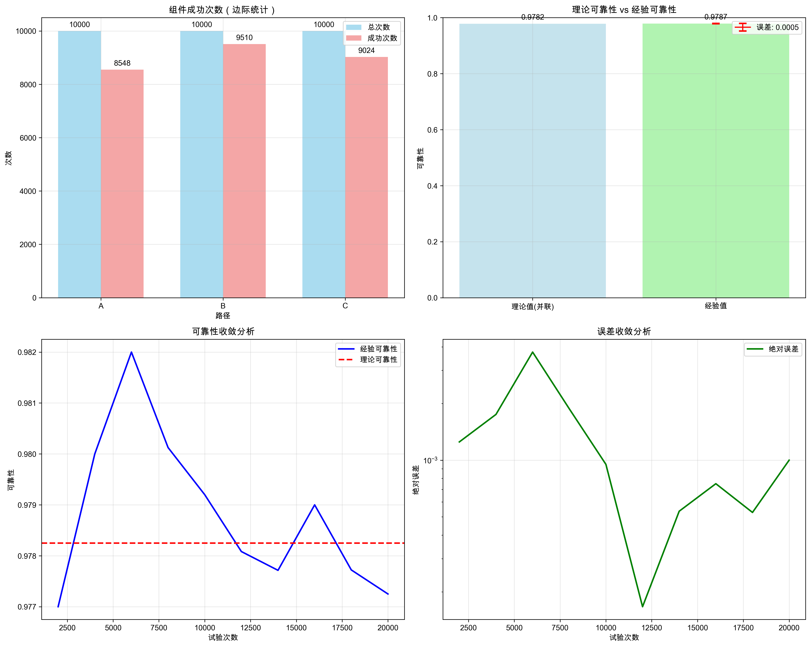

作业一：蒙特卡洛方法练习

学号：                                         姓名：
授课教师：梁上松，中山大学

练习1. 
蒙特卡洛方法可以用于产生接近pi的近似值。图1显示了一个带有1/4内切圆在内的边长为1的正方形。正方形的面积是1，该1/4圆的面积为pi/4。通过编程实现在这个正方形中产生均匀分布的点。落在圈内（红点）的点和总的投在正方形（红和绿点）上的点的比率给出了pi/4的近似值。这一过程称为使用蒙特卡洛方法来仿真逼近pi实际值。令N表示总的投在正方形的点。当投点个数分别是20, 50, 100, 200, 300, 500, 1000, 5000时，pi值分别是多少？对于每个N，每次实验算出pi值，重复这个过程100次，并在表中记下均值和方差。

图1 蒙特卡洛方法求解pi

答案与图表：
- 关键数值：N=5000 时，π均值=3.143736，方差=0.000558，标准差=0.023625；相对误差=0.068%。
- 可视化：见下图（左：投点示意；右：收敛曲线）。

练习2. 
我们现在尝试通过蒙特卡洛的方法求解如下的积分：

$$ I = \int_{0}^{1} e^x  dx $$

该积分的求解我们可以直接求解，即有：

$$ I = e - 1 \approx 1.71828 $$

如果你用蒙特卡洛的方法求解该积分，你认为x可以通过什么分布采样获得？如果采样次数是分别是N = 5, 10, 20, 30, 40, 50, 60, 70, 80, 100，积分结果有多好？对于每个采样次数N，重复蒙特卡洛过程100次，求出均值和方差，然后在表格中记录对应的均值和方差。

答案与图表：
- 关键数值：N=100 时，均值=1.716561，方差=0.002400，标准差=0.048985，相对误差=0.100%。
- 真实值：e−1=1.718282。
- 可视化：函数曲线与采样点、收敛/误差/方差分析。

练习3.
我们现在尝试通过蒙特卡洛的方法求解如下的更复杂的积分：

$$ I = \int_{0}^{1} \int_{0}^{1} e^{-(x^2 + y^2)}  dx  dy $$

其中：

$$ f(x, y) = e^{-(x^2 + y^2)} $$

你能够通过公式直接求解上述的积分吗？如果你用蒙特卡洛的方法求解该积分，你认为(x, y)可以通过什么分布采样获得？如果点（x, y）的采样次数是分别是N = 10, 20, 30, 40, 50, 60, 70, 80, 100, 200, 500, 积分结果有多好？对于每个采样次数N，重复蒙特卡洛过程100次，求出均值和方差，然后在表格中记录对应的均值和方差。

答案与图表：
- 解析解：0.557746（scipy 计算）。
- 关键数值：N=80 时均值=0.557728，误差≈1.8×10^-5，相对误差≈0.0033%；N=500 时标准差=0.009278。
- 可视化：曲面/等高线、收敛、误差与方差、采样分布。

练习4.
一只蚂蚁试图在网格中从点A到达点B。点A的坐标是(1,1)（这是左上角），点B的坐标是(n,n)（这是右下角，n是网格的大小）。
一旦蚂蚁开始移动，有四个选择，它可以向左、向右、向上或向下移动（不允许对角线移动）。如果这四个选择中的任何一个满足以下条件：
(a) 新点仍应在n×n网格的边界内
(b) 只有中心点(4, 4)允许被访问零次、一次或两次，而其余点不应被之前访问过（允许被访问零次或一次）。
如果P是蚂蚁在7×7网格中到达点B的概率，使用蒙特卡洛仿真来计算P。选择最接近P值的答案（假设20,000次仿真足以计算P）。

图2 一只蚂蚁试图在网格中从点A (1,1)到达点B (7,7)。

答案与图表：
- 关键数值：P(到达)≈0.258450（20,000 次仿真）；最接近选项：0.3。
- 路径统计：成功路径=5169；平均路径长度≈22.40；方向偏好：右/下≈78%。
- 可视化：网格路径示例与成功路径长度分布。

练习5.
给定一个由已知可靠性的分立部件组成的系统，整个系统的可靠性是多少？例如，假设我们有一个可以用以下高级图描述的系统：

图3 由分立部件组成的系统。

当给定系统输入时，系统包含两条并联路径：上支路为组件A，下支路为组件B与组件C串联。只要至少有一条路径工作，系统就成功。概率论告诉我们以下内容：

$$ \text{reliability}_{BC} = 0.95 \times 0.90 = 0.855 $$

$$ \text{reliability}_A = 0.85 $$

整个系统的可靠性（并联）为：

$$ R_{\text{系统}} = 1 - \big(1 - R_A\big)\,\big(1 - R_{BC}\big) = 1 - (1-0.85)(1-0.855) = 0.97825 $$

创建该系统的仿真：每次试验独立判断组件A是否成功（阈值0.85），组件B是否成功（0.95）和组件C是否成功（0.90）。若“A成功”或“B与C同时成功”，则系统成功。运行多次试验，观察经验可靠性是否收敛到理论值0.97825。

答案与图表：
- 理论值：R_sys = 0.97825。
- 经验值：10,000 次仿真 R̂≈0.97870（误差≈0.00045）；收敛性良好。
- 可视化：理论 vs 经验可靠性、以及收敛与误差曲线。

