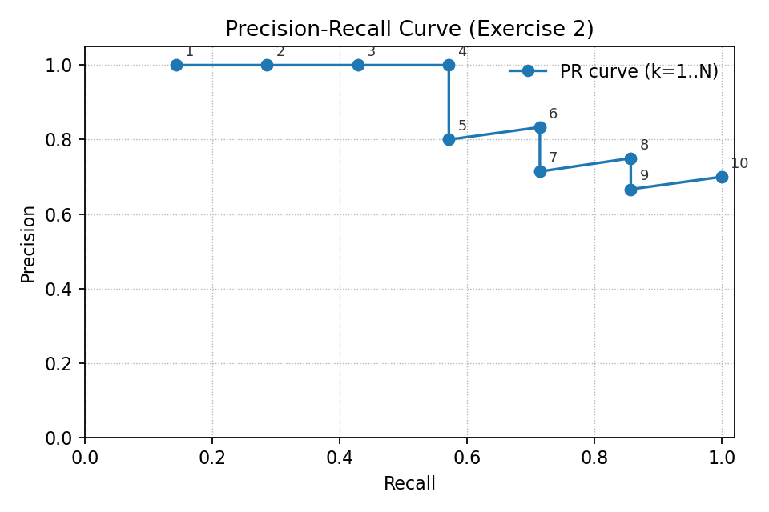

23336128 梁力航
# 作业2：评估指标

## 练习1：基于排序的评估指标，MAP@K, MRR@K

**已知**

* 查询#1 排序（相关文档为二进制1）：d1,d2,d3,d4,d5,d6,d7,d8,d9,d10；相关的有 d1,d3,d4,d6,d7,d10 → 相关向量（按排名）
  `q1 = [1,0,1,1,0,1,1,0,0,1]`，总相关数 R1 = 6。

* 查询#2 排序：d3,d8,d7,d1,d2,d4,d5,d9,d10,d6；相关的有 d8,d9 →
  `q2 = [0,1,0,0,0,0,0,1,0,0]`，R2 = 2。

* 查询#3 排序：d7,d6,d5,d3,d2,d1,d9,d10,d4,d8；相关的有 d5,d9,d8 →
  `q3 = [0,0,1,0,0,0,1,0,0,1]`，R3 = 3。

### (a) 每个查询的 AP@5、AP@10；RR@5、RR@10

**查询 #1**

* AP@5 = 0.4833333333 
  计算细节：相关位于 1,3,4（在前5），对应 P@1=1, P@3=2/3, P@4=3/4；用 (/ \min(R,5)=/5) 归一化所得 ≈0.48333。
* AP@10 = 0.7329365079
  相关位于 1,3,4,6,7,10；按公式求和再除以 min(R,10)=6。
* RR@5 = 1.0（第一个相关在 rank1）
* RR@10 = 1.0

**查询 #2**

* AP@5 = 0.25
  仅在前5出现的相关是 rank2，P@2 = 1/2；除以 min(R,5)=2 → 0.25。
* AP@10 = 0.375
  相关位于 rank2 和 rank8：P@2=0.5, P@8=2/8=0.25；(0.5+0.25)/2 = 0.375。
* RR@5 = 0.5（第一个相关在 rank2）
* RR@10 = 0.5

**查询 #3**

* AP@5 = 0.1111111111
  在前5唯一相关为 rank3：P@3=1/3，除以 R=3 → 1/3 / 3 = 1/9 ≈0.11111。
* AP@10 = 0.3063492063
  相关位于 3,7,10：P@3=1/3, P@7=2/7, P@10=3/10；和除以 R=3 得约0.30635。
* RR@5 = 1/3 ≈ 0.3333333（第一个相关在 rank3）
* RR@10 = 1/3 ≈ 0.3333333

### (b) 系统级指标：MAP@5、MAP@10、MRR@5、MRR@10

* **MAP@5** = (AP@5(q1)+AP@5(q2)+AP@5(q3)) / 3
  = (0.4833333333 + 0.25 + 0.1111111111) / 3 = **0.2814814815**。

* **MAP@10** = (0.7329365079 + 0.375 + 0.3063492063) / 3 = **0.4714285714**。

* **MRR@5** = mean(RR@5) = (1.0 + 0.5 + 0.3333333)/3 = **0.6111111111**。

* **MRR@10** = mean(RR@10) = 同上 = **0.6111111111**。

---

## 练习2：Precision@K, Recall@K, NDCG@K（单一查询，表1）

表中 binary relevance（前10）：
`rel = [1,1,1,1,0,1,0,1,0,1]`，总相关数 R = 7。

### (a) 计算 P@5 和 P@10

* P@5 = (相关数在前5) / 5 = 4 / 5 = **0.8**
  （前5 的 binary 是 1,1,1,1,0 → 4/5）
* P@10 = 7 / 10 = **0.7**

### (b) 计算 R@5 和 R@10

* R@5 = (相关检索到的数在前5) / R = 4 / 7 ≈ **0.57142857**
* R@10 = 7 / 7 = **1.0**

### (c) 能最大化此查询 P@5 的排序示例

* 要最大化 P@5，应使前5 全部为相关文档（P@5 = 1.0 是上界）。
  例如将任意 5 个相关文档放在前5：例如 `[832, 103, 256, 771, 511, ...其余...]`（前5 全为 binary relevance=1）。

### (d) 能最大化此查询 P@10 的排序示例

* P@10 的上界受限于前10中相关总数（这里是7），所以最大 P@10 = 7/10 = 0.7。任何把这7个相关文档保留在前10 的排序都能达到 0.7。题中给定排序已达到上界。

### (e) 能最大化此查询 R@5 的排序示例

* R@5 最大为 5/7 ≈ 0.7142857（因前5 最多放 5 个相关）。
  示例：把任意 5 个相关放到前5（如 (c)），即可得到 R@5 = 5/7。

### (f) 能最大化此查询 R@10 的排序示例

* R@10 的上界为 1.0（把所有 7 个相关都放在前10）。已有排序已满足 R@10 = 1.0。

### (g) 若用户想要“检查给定查询的每一个相关文档”（追求完美召回），是否存在特别合适的、针对特定查询的 K 值？是什么？

* 是的：选择 (K = R)（该查询的相关文档总数），这就是 **R-Precision**（R-精度）。R-Precision = 精度@R，当用户想要检索出所有相关文档并以精度为评价指标时，K 取 R 最合适。

### (h) 计算平均精度（AP）；AP 与 MAP 的区别是？

* **AP（Average Precision）**（对该单查询）按二进制相关性计算：
  $$\text{AP} = \dfrac{1}{R}\sum_{k:\,\text{rel}(k)=1} P@k$$
  对本查询计算得：**AP = 0.8976190476**（约 0.89762）。

* **区别**：AP 是单个查询的平均精度；**MAP（Mean Average Precision）** 是对多个查询的 AP 求平均。

### (i) 能最大化此查询 AP 的排序示例

* 为最大化 AP，应把所有相关文档尽可能靠前（把所有 7 个相关放在最前面），即把 7 个相关文档按任意顺序放在前7，接着放不相关的。在二值 AP 情况下，只要前面全是相关（无非相关打断）就能最大化 AP。
  例如：`[832,103,256,771,511,120,690, 909,302,441]`（前7 全为 binary=1）。

### (j) 计算 (DCG@5)（用分级相关性）
表中前5 位的 graded relevance = `[4, 3, 2, 1, 0]`，因此

* (DCG@5 = 21.3471848331)

### (k) 计算 (NDCG@5)

* (i) **理想前5排名（按 graded relevance 从高到低）**：题目给出的相关性池中有 2 个 4、1 个 3、1 个 2、3 个 1；理想的前5 应取最高的五个：`[4,4,3,2,1]`。
* (ii) 用同一 DCG 公式计算该理想排名的 (IDCG@5)：
  (IDCG@5 \approx 29.6428287850)。
* (iii) (NDCG@5 = DCG@5 / IDCG@5 \approx 21.3471848331 / 29.6428287850 \approx) **0.7201466833**（约 **0.72015**）。

### (l) 还可用于评估此排序的其他指标（并给出数值）
* Precision@1 = 1/1 = **1.0**（top1 为相关）

* Precision@3 = 3/3 = **1.0**（top3 全相关）

* Precision@5 = **0.8**（如上）

* Precision@10 = **0.7**（如上）

* Recall@5 = **4/7 ≈ 0.5714286**

* Recall@10 = **1.0**

* **F1@10**（把 top10 视为检索结果）：
  (F1 = 2 \cdot \dfrac{P@10 \cdot R@10}{P@10 + R@10} = 2 \cdot \dfrac{0.7 \cdot 1}{0.7 + 1} ≈ 0.823529)。

## 练习3：精确率-召回率（PR）曲线（针对练习2的排序）

## 练习4：其他评估指标（类型、适用任务、计算方法简述）

1. **Accuracy（准确率）**

   * 任务：二分类 / 多分类（当类别不严重不平衡时）。
   * 计算：((TP+TN)/(TP+TN+FP+FN))。

2. **Precision / Recall / F1-score（精确率/召回率/F1）**

   * 任务：二分类、多标签（常用）
   * 计算：(Precision = TP/(TP+FP),; Recall=TP/(TP+FN),; F1=2PR/(P+R))。

3. **ROC AUC（受试者工作特征曲线下面积）**

   * 任务：二分类（按模型打分排序，评估整体判别能力）
   * 计算：曲线下面积（TPR vs FPR），常用库直接计算。

4. **PR AUC / Average Precision（精度-召回曲线下面积 / AP）**

   * 任务：当阳性样本稀少或不均衡时常优于 ROC-AUC。
   * 计算：对 PR 曲线进行积分或按插值法计算平均精度（AP）。

5. **BLEU / ROUGE / METEOR / CIDEr**

   * 任务：机器翻译、自动摘要、图像描述等自然语言生成任务。
   * 计算：基于 n-gram 重叠（BLEU）、召回/精确比（ROUGE）、更复杂的语义匹配（METEOR）等。

9. **Rank-based metrics：Kendall’s Tau / Spearman’s rho / NDCG / ERR / MRR / R-Precision / bpref**

   * 任务：信息检索、搜索结果排序、推荐系统。
   * 计算：比较排序一致性或计算按位折损增益 / 期望倒数排名 等。

10. **Calibration metrics（校准度）**

    * 任务：概率输出是否校准（例如分类器的输出概率）。
    * 计算：Reliability diagram、ECE（Expected Calibration Error）等。

11. **Regression metrics：MSE / RMSE / MAE / R²**

    * 任务：回归问题。
    * 计算：均方误差 / 平均绝对误差 / 决定系数等。

12. **业务特定指标**

    * 任务：广告（CTR、ARPU）、搜索/推荐（点击率、转化率、停留时间）、异常检测（召回重要但 FPR 可控）等。
    * 计算：与业务目标直接相关的 KPI（需结合实际定义）。

---

